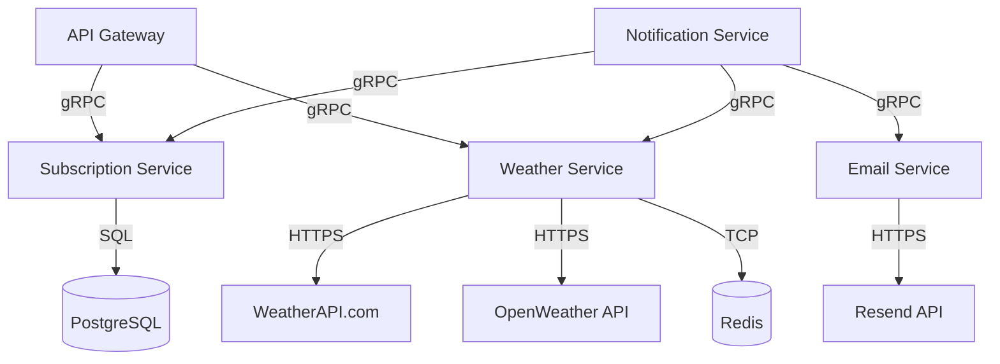

# ADR-004: Choosing a Communication Protocol for Microservices

**Status:** Accepted  
**Date:** 2025-07-06  
**Author:** Illia Yuriev

## Context

As part of the transition to a microservices architecture, it is necessary to select a communication protocol for interaction between the following extracted services: notification, email, weather, and subscription. The protocol must support efficient, reliable, and scalable communication, and be suitable for both synchronous and asynchronous use cases.

## Considered Options

### 1. REST API

**Pros:**

- Simple to implement and widely supported
- Human-readable and easy to debug
- Language-agnostic

**Cons:**

- Less efficient for high-throughput or low-latency scenarios
- No built-in support for streaming or bidirectional communication
- Can introduce tight coupling between services

### 2. gRPC

**Pros:**

- High performance and low latency
- Strongly-typed contracts via Protocol Buffers
- Supports streaming and bidirectional communication
- Good tooling for code generation and documentation
- Widely used for internal service-to-service communication

**Cons:**

- More complex setup and learning curve
- Not as human-readable as REST
- Requires additional tooling for debugging and monitoring

### 3. Message Broker (RabbitMQ, Kafka, Redis Pub/Sub)

**Pros:**

- Enables asynchronous, decoupled communication
- Supports retries, dead-lettering, and horizontal scaling
- Good for event-driven architectures and background processing

**Cons:**

- Adds infrastructure complexity
- Not suitable for all synchronous request/response scenarios
- Requires additional monitoring and operational overhead

## Decision

gRPC is chosen as the primary communication protocol between microservices (notification, email, weather, subscription).

## Architecture Diagram

## Consequences

**Positive:**

- Efficient, type-safe, and scalable communication between services
- Support for streaming and advanced communication patterns
- Reduced boilerplate and improved maintainability
- Consistent API contracts across all services

**Negative:**

- Increased complexity in setup and debugging compared to REST
- Requires additional tooling for monitoring and troubleshooting
- Not as human-readable as REST for manual testing
