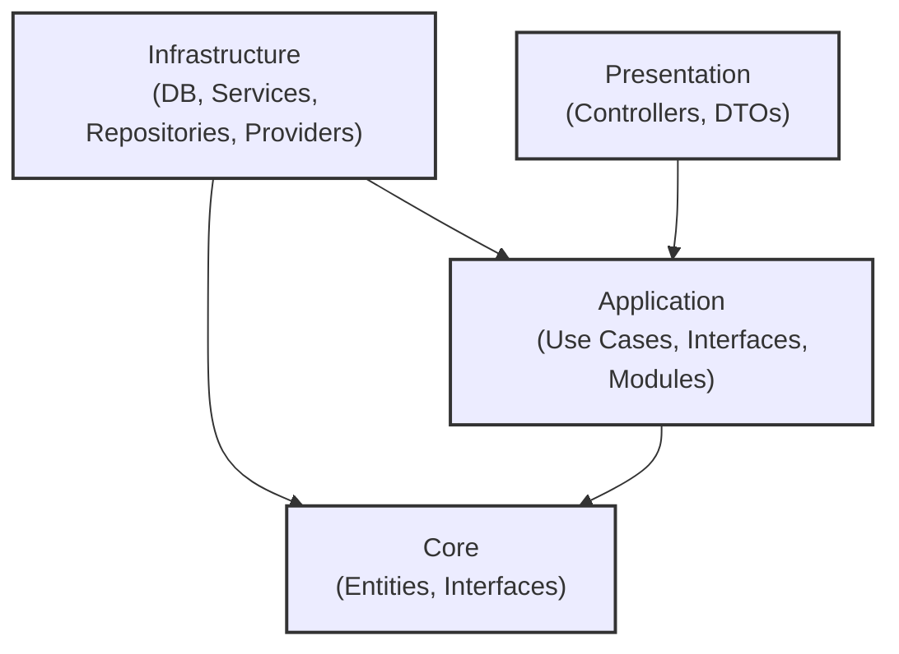

```mermaid
flowchart TD
    Core["Core
    (Entities, Interfaces)"]
    Application["Application
    (Use Cases, Interfaces, Modules)"]
    Infrastructure["Infrastructure
    (DB, Services, Repositories, Providers)"]
    Presentation["Presentation
    (Controllers, DTOs)"]

    Application --> Core
    Infrastructure --> Core
    Infrastructure --> Application
    Presentation --> Application

    classDef layer fill:#f,stroke:#333,stroke-width:2px;
    classDef forbiddenLink stroke:#f66,stroke-width:3px,stroke-dasharray:5 5;
    class Core,Application,Infrastructure,Presentation layer;
```
