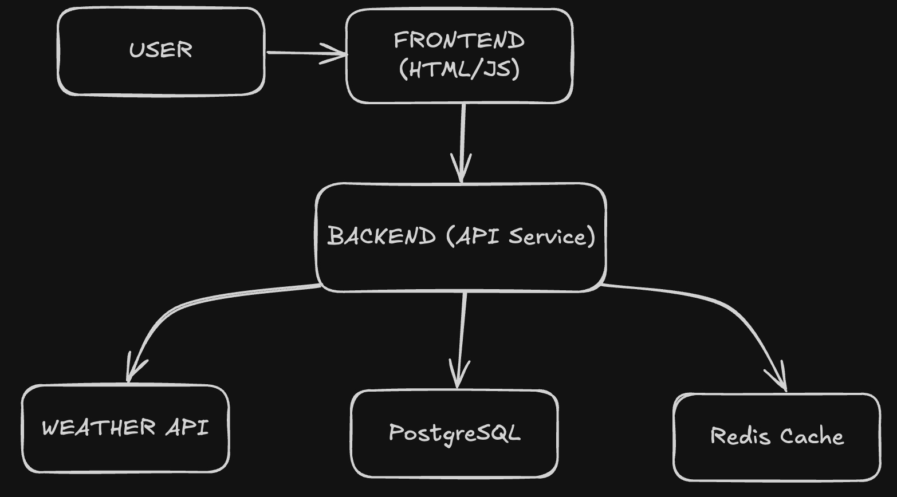

# System Design: Weather Subscription Service

## 1. System requirements

### Functional requirements

* Users can get weather information for a specific city
* Users can subscribe to weather updates for a specific city
* The system sends regular notifications (hourly/daily)
* Users can choose the notification frequency (hourly/daily)
* Users can unsubscribe via a link in the email
* Email confirmation upon subscription
* City and email validation
* Logging of actions and errors

### Non-functional requirements

* **Availability:** 99.9% uptime
* **Scalability:** up to 100,000 users, up to 1,000,000 notifications per day
* **Latency:** < 150 ms for API requests
* **Reliability:** guaranteed delivery of notifications
* **Security:** authentication and data validation
* **Maintainability and extensibility:** modular architecture, at least 80% test coverage

### Constraints

* Budget: limited by free tiers of WeatherAPI and SMTP
* Compliance: GDPR compliance (minimization of personal data storage)
* External API: WeatherAPI.com (rate limit)

## 2. Load estimation

### Users and traffic

- **Active users:** 75,000
- **Subscriptions per user:** 5-6 (average)
- **API requests:** up to 5,000 RPS (peak)
- **Notifications:** up to 1,000,000 per day

### Data

- **User record:** ~400 bytes
- **Subscription record:** ~600 bytes
- **Weather cache:** ~2 KB per city
- **Total storage:** ~90 GB/year

### Bandwidth

- **Incoming:** 3 Mbps
- **Outgoing:** 6 Mbps (emails)
- **External API:** 50 Mbps

## 3. High-level Architecture



## 4. Detailed component design

### 4.1 API Service (NestJS)

**Responsibilities:**
- Handling REST API requests
- Email confirmation
- Data validation (email, city, frequency)
- CRUD operations with subscriptions
- Fetching and caching weather data
- Logging actions and errors

**Endpoints:**
```
POST   /api/v1/subscribe                — create a subscription
GET    /api/v1/confirm/:token           — confirm subscription
GET    /api/v1/unsubscribe/:token       — unsubscribe
GET    /api/v1/weather?city=            — get weather by city
```

---

### 4.2 Scheduler

**Responsibilities:**
- Running notification sending tasks on schedule (cron)
- Selecting active subscriptions from the database
- Initiating email sending via Email Notifier

---

### 4.3 Email Notifier

**Responsibilities:**
- Generating and sending email notifications to users
- Inserting confirmation and unsubscribe links
- Working via SMTP (Nodemailer)

---

### 4.4 Weather API Integration
* Caching Strategy:
    - L1 Cache (Redis): 5-minute TTL for weather data.
    - Fallback: Trigger a Weather API request only when the cache is empty.
---

### 4.5 PostgreSQL

**Responsibilities:**
- Storing users, subscriptions, tokens
- Fast search and filtering by email, city, status

**Database Schema:**

- subscriptions table:
```prisma
model Subscription {
  id         Int        @id @default(autoincrement())
  email      String
  city       String
  frequency  Frequency
  confirmed  Boolean     @default(false)
  tokens     Token[]
  createdAt  DateTime    @default(now())
  updatedAt  DateTime    @updatedAt

  @@map("subscription")
}
```

### 4.6 Redis Cache

**Responsibilities:**
- Caching weather data for popular cities
- Reducing load on the external Weather API

## 5. Security Design

- Validation and filtering of input data (email, city, frequency)
- Cryptographically strong tokens for confirmation and unsubscribe
- Minimizing storage of personal data (only email and city)
- Logging suspicious actions and errors

## 6. Testing Strategy

- **Unit tests:** for services, utilities, validation (Jest)
- **Integration tests:** interaction between modules and with the database (Supertest)
- **E2E tests:** full subscription, confirmation, and unsubscribe cycle
- **CI/CD:** automatic test runs via GitHub Actions

## 7. Future Enhancements

- Adding push notifications (web push, Telegram bot)
- Support for multiple interface and email languages
- Expanding notification types (e.g., weather anomaly alerts)
- Integration with additional weather APIs for increased reliability